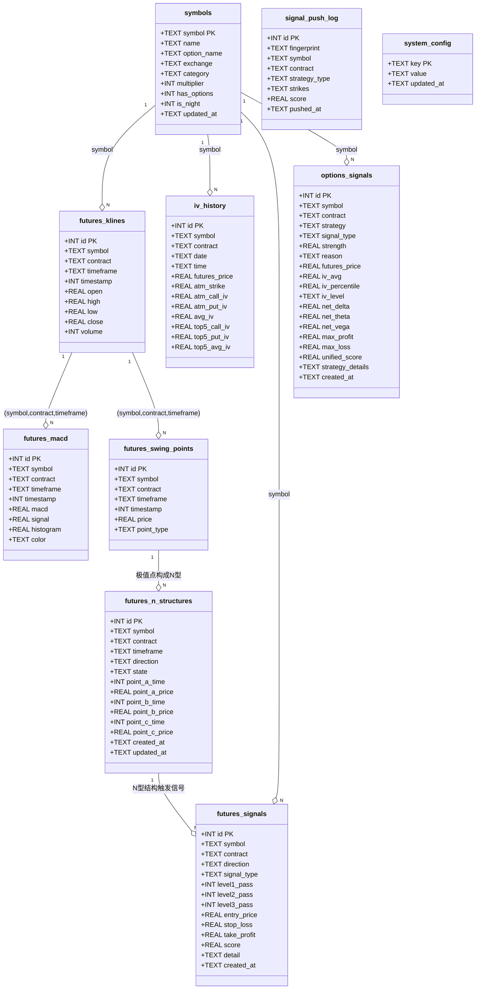
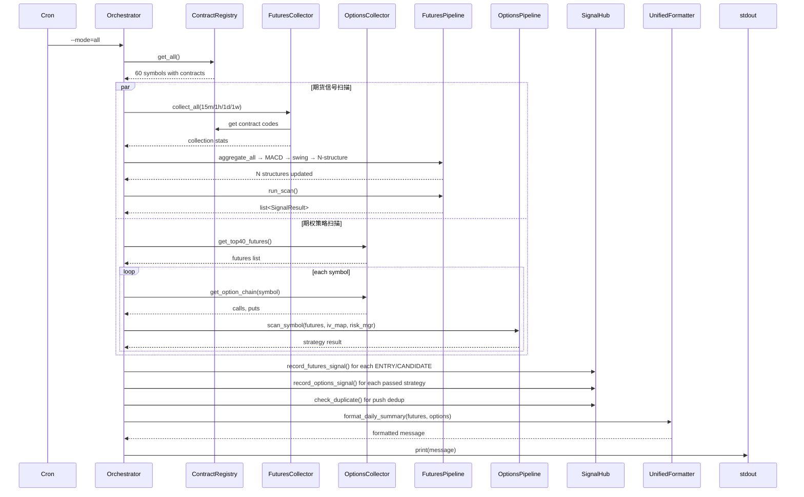
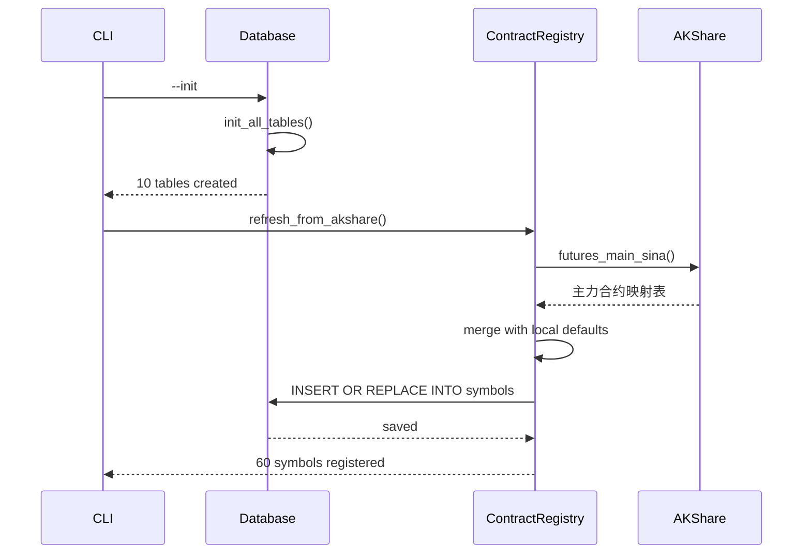
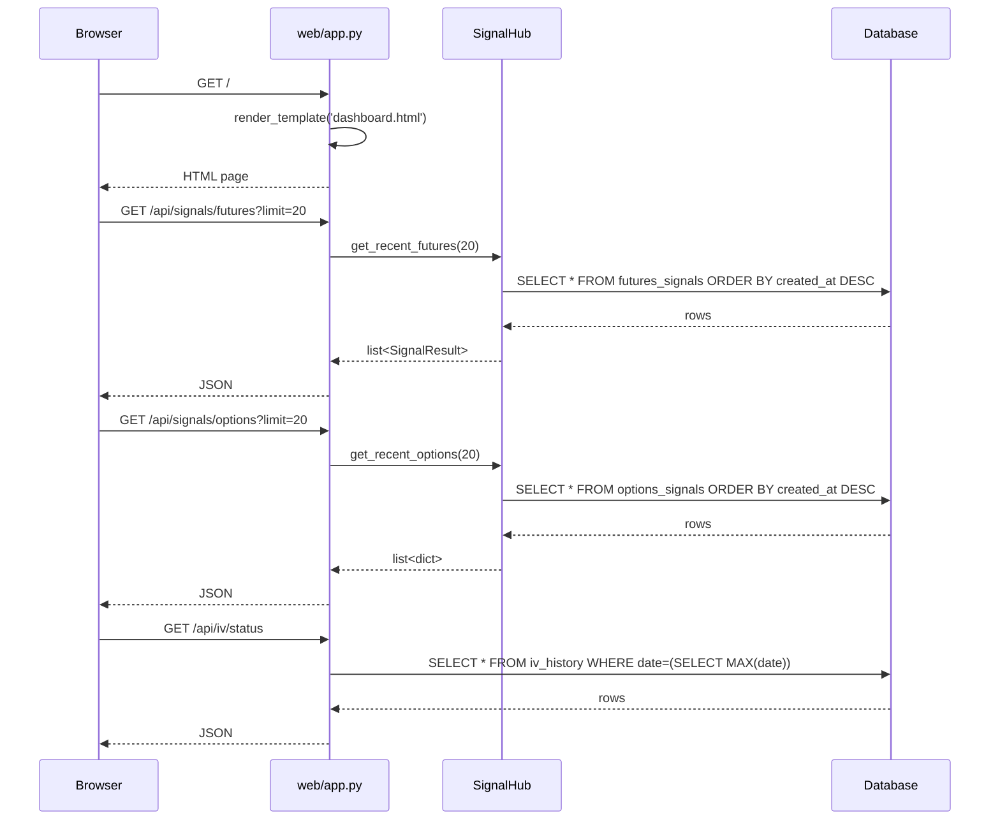
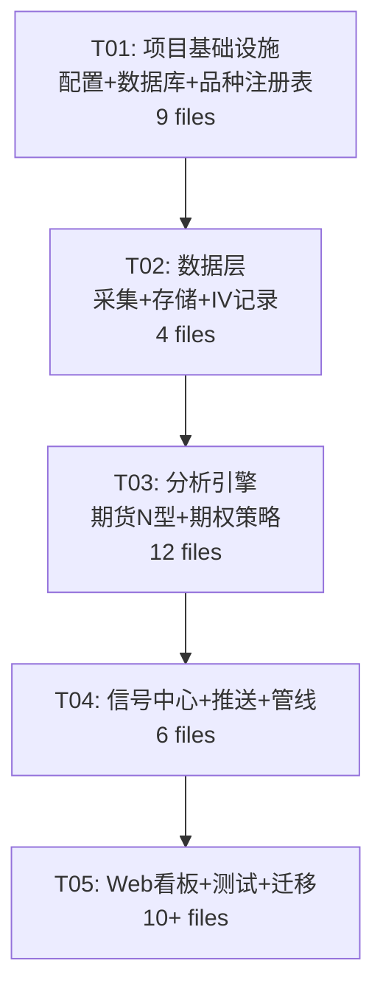

# 期货信号 + 期权策略 — 整合系统架构设计

> 架构师: Bob (高见远) | 日期: 2025-07-16

---

## 目录

- [Part A: 系统设计](#part-a-系统设计)
  - [1. 实现方案](#1-实现方案)
  - [2. 文件列表](#2-文件列表)
  - [3. 数据结构与接口](#3-数据结构与接口)
  - [4. 程序调用流](#4-程序调用流)
  - [5. 待明确问题](#5-待明确问题)
- [Part B: 任务分解](#part-b-任务分解)
  - [6. 依赖包](#6-依赖包)
  - [7. 任务列表](#7-任务列表)
  - [8. 共享知识](#8-共享知识)
  - [9. 任务依赖图](#9-任务依赖图)

---

## Part A: 系统设计

### 1. 实现方案

#### 1.1 核心技术挑战

| # | 挑战 | 描述 | 策略 |
|---|------|------|------|
| 1 | **双数据源分歧** | 期货系统用 AKShare(Sina期货K线)，期权系统用 Sina API + AKShare，两者对同一品种的合约代码格式不完全一致 | 统一合约管理层 `ContractRegistry`，双方查询合约信息均通过唯一入口 |
| 2 | **存储引擎不统一** | 期货系统用 SQLite (futures_kline.db, 6张表)，期权系统用 JSON(signals.json) + SQLite(iv_history.db) | 统一到一个 SQLite 数据库 `trading_system.db`，信号也从JSON迁移到SQLite |
| 3 | **品种映射多副本** | 期货有 53 品种 (KNOWN_MAIN_CONTRACTS)，期权有 60 品种 (COMMODITIES)，两份中文名映射、期权名映射各自维护 | 建立单一品种母表 `symbols`，统一品种→中文名→期权名→交易所的映射关系 |
| 4 | **推送格式不兼容** | 期货用三级嵌套信号（WATCH/CANDIDATE/ENTRY），期权用策略评分排序（ratio_spread/short_strangle/iron_condor） | 设计统一消息容器 `UnifiedMessage`，按子系统分别渲染，统一推送出口 |
| 5 | **看板缺失** | 期货有静态HTML生成但无实时能力，期权完全无看板 | 新增长轻量 Flask Web 服务，提供API + 动态渲染 |

#### 1.2 架构模式

采用 **模块化单体架构 (Modular Monolith)**：

```
┌─────────────────────────────────────────────────────────────┐
│                   pipeline/orchestrator.py                   │
│                   (统一调度入口 — 唯一main)                    │
├──────────────┬──────────────┬──────────────┬────────────────┤
│   futures/   │   options/   │   signal/    │     web/       │
│  (N型信号)    │  (期权策略)   │ (统一信号中心) │   (Flask看板)   │
├──────────────┴──────────────┴──────────────┴────────────────┤
│                      data/ (数据采集层)                       │
├─────────────────────────────────────────────────────────────┤
│            core/ (数据库 + Schema + 品种注册)                  │
├─────────────────────────────────────────────────────────────┤
│                   config/ (全局配置层)                         │
└─────────────────────────────────────────────────────────────┘
```

**理由**：两个子系统共享数据源和推送通道，但业务逻辑独立（技术分析 vs 期权定价），不适合微服务拆分。模块化单体在保持部署简单的同时实现了代码级共享。

#### 1.3 框架选型

| 层次 | 选型 | 理由 |
|------|------|------|
| Web框架 | **Flask 3.x** | 轻量，两个项目都是Python CLI，引入最小化Web依赖；FastAPI可选但过度 |
| 数据库 | **SQLite (单文件)** | 现状，两个项目已用SQLite；数据量<10万行/天，不需要Postgres |
| 数据源 | **AKShare + Sina API** | 现状，保持不变；通过 ContractRegistry 抽象 |
| 模板引擎 | **Jinja2 (Flask内置)** | 替代现有 `generate_signal_board.py` 的字符串拼接方案 |
| 任务调度 | **不变 (系统cron)** | cron + `pipeline/orchestrator.py --mode=futures\|options\|all` |
| 图表 | **ECharts (CDN)** | 看板前端，轻量免构建 |
| 测试 | **pytest (不变)** | 迁移现有79个期货测试 + 补充期权测试 |

#### 1.4 整合深度评估

```
Phase 1 (本次): 基础设施整合
  ✅ 统一目录结构
  ✅ 统一数据库 Schema
  ✅ 统一品种管理
  ✅ 统一日志配置
  ✅ 统一推送出口

Phase 2 (后续): 管线整合
  ⬜ 统一调度器 (一个cron入口同时运行期货扫描+期权扫描)
  ⬜ 数据采集去重 (期货行情采集一次，双方共享)

Phase 3 (后续): 业务协同
  ⬜ 期权信号引用期货N型方向作为IV策略的补充因子
  ⬜ 期货N型信号结合IV百分位做风险调整
```

本次整合深度为 **Phase 1 — 基础设施整合**，两个子系统保持独立运行能力，但共享数据层、配置层和推送通道。

#### 1.5 共享模块识别

| 模块 | 共享方式 | 来源 |
|------|---------|------|
| **品种注册表** (`core/contracts.py`) | 新建，整合两份品种列表 | Project A `config.KNOWN_MAIN_CONTRACTS` + Project B `config.COMMODITIES` + `OPTION_NAME_MAP` |
| **数据库连接** (`core/db.py`) | 新建，单一连接工厂 | Project A `db/kline_store.py::get_conn()` |
| **K线存储** (`data/futures_collector.py`) | 从Project A迁移，增加统一品种参数 | Project A `data/collector.py` |
| **IV历史** (`data/iv_recorder.py`) | 从Project B迁移，迁移到统一DB | Project B `iv_history_db.py` |
| **日志配置** (`config/logging_config.py`) | 新建，统一 `logging.basicConfig` | 两项目日志配置合并 |
| **消息格式化** (`signal/formatter.py`) | 新建，统一消息容器 | Project A `push/wechat_push.py` + Project B `pipeline_orchestrator.py::format_wechat_message` |

---

### 2. 文件列表

```
futures_options_system/
├── config/
│   ├── __init__.py
│   ├── settings.py              # 全局配置：路径、时区、MACD参数、三级验证参数、策略阈值
│   ├── contracts.py             # 统一品种注册表：symbol→中文名→期权名→交易所→乘数
│   └── logging_config.py        # 统一日志配置
│
├── core/
│   ├── __init__.py
│   ├── db.py                    # 数据库连接工厂 + 初始化入口
│   └── schema.py                # 统一Schema：10张表的CREATE语句
│
├── data/
│   ├── __init__.py
│   ├── futures_collector.py     # K线采集（AKShare Sina）+ 3m聚合
│   ├── options_collector.py     # 期权链采集（Sina API）+ Black-76 IV/Greeks
│   └── iv_recorder.py           # IV历史快照记录 + 百分位查询
│
├── futures/
│   ├── __init__.py
│   ├── aggregator.py            # 多周期K线聚合（15m/1h/1d/1w）
│   ├── macd.py                  # MACD计算（两色方案）
│   ├── swing_points.py          # 波峰波谷检测
│   ├── n_structure.py           # N型状态机（同向合并/正N倒N/COMPLETED判定）
│   ├── scorer.py                # 三级嵌套验证评分器
│   └── color_tracker.py         # MACD颜色轨迹验证（Level2核心）
│
├── options/
│   ├── __init__.py
│   ├── pricing.py               # Black-76模型 + Greeks + IV反推
│   ├── ratio_spread.py          # 比例价差计算器
│   ├── multi_strategy.py        # Iron Condor / Short Strangle
│   └── risk_manager.py          # 风控（Delta/OI/IV/保证金）
│
├── signal/
│   ├── __init__.py
│   ├── hub.py                   # 统一信号中心：存储（SQLite）、查询、去重
│   ├── formatter.py             # 统一消息格式化：UnifiedMessage → 微信文本
│   └── dispatcher.py            # 分级推送调度：URGENT/DAILY/WEEKLY
│
├── pipeline/
│   ├── __init__.py
│   ├── orchestrator.py          # 统一调度入口：--mode=futures|options|all|eod
│   └── cron.py                  # Cron配置模板 + 辅助函数
│
├── web/
│   ├── __init__.py
│   ├── app.py                   # Flask应用 + API路由
│   ├── templates/
│   │   ├── base.html            # 基础模板
│   │   ├── dashboard.html       # 统一看板：期货信号 + 期权策略
│   │   └── signals.html         # 信号历史查询页
│   └── static/
│       └── style.css            # 全局样式
│
├── tests/
│   ├── __init__.py
│   ├── conftest.py              # 共享fixtures（临时DB、品种注册）
│   ├── test_futures/
│   │   ├── __init__.py
│   │   ├── test_n_structure.py
│   │   ├── test_color_tracker.py
│   │   ├── test_scorer.py
│   │   └── test_breakout.py
│   └── test_options/
│       ├── __init__.py
│       ├── test_pricing.py
│       └── test_risk_manager.py
│
├── scripts/
│   ├── init_db.py               # 数据库初始化
│   └── migrate_data.py          # 从旧两项目的DB迁移数据
│
├── trading_system.db            # 统一SQLite数据库（运行时生成）
├── requirements.txt
└── README.md
```

---

### 3. 数据结构与接口

#### 3.1 统一数据库 Schema（10张表，合并自6+1=7张现有表）



#### 3.2 核心服务类接口

```mermaid
classDiagram
    class ContractRegistry {
        -Dict symbols
        +__init__(db_path)
        +get(symbol) dict
        +get_all() list~dict~
        +get_with_options() list~dict~
        +get_night_symbols() set~str~
        +get_option_name(symbol) str
        +get_multiplier(symbol) int
        +refresh_from_akshare() int
    }

    class Database {
        -str db_path
        +__init__(db_path)
        +get_conn() Connection
        +init_all_tables()
        +migrate_from_old(old_db_path)
    }

    class KlineStore {
        -Database db
        +batch_insert(rows)
        +get_last_timestamp(symbol,contract,tf) int
        +get_klines(symbol,contract,tf,limit,offset) list
        +get_contracts_with_data() list
    }

    class MACDStore {
        -Database db
        +batch_insert(rows)
        +get_macd(symbol,contract,tf,limit) list
        +get_recent_colors(symbol,contract,tf,n) list
        +get_in_range(symbol,contract,tf,start,end) list
    }

    class SwingPointStore {
        -Database db
        +batch_insert(rows)
        +get_swing_points(symbol,contract,tf,limit) list
    }

    class NStructureStore {
        -Database db
        +save(n_struct) int
        +get_active(symbol,contract,tf) dict
        +get_all(symbol,contract,tf,limit) list
    }

    class FuturesSignalStore {
        -Database db
        +save(signal) int
        +get_recent(symbol,limit) list
        +get_stats() dict
    }

    class IVHistoryStore {
        -Database db
        +save_snapshot(symbol,contract,price,calls,puts) bool
        +get_history(symbol,days) list
        +calc_percentile(symbol,current_iv,days) dict
        +get_all_status(days) list
    }

    class OptionsSignalStore {
        -Database db
        +save(signal) int
        +get_recent(symbol,limit) list
    }

    class SignalHub {
        -Database db
        +record_futures_signal(SignalResult) int
        +record_options_signal(dict) int
        +check_duplicate(fingerprint,hours) bool
        +get_push_log() list
        +prune_old(days)
    }

    class FuturesCollector {
        -ContractRegistry registry
        -KlineStore store
        +collect_symbol(symbol,contract,periods) dict
        +collect_all(periods) dict
        +aggregate_3m_from_1m(symbol,contract,rows) list
    }

    class OptionsCollector {
        -ContractRegistry registry
        +get_top40_futures() list
        +get_option_chain(opt_name,contract,underlying) tuple
    }

    class FuturesPipeline {
        -ContractRegistry registry
        +collect_and_process(symbol,contract,has_collect) dict
        +run_scan(all_contracts) list~SignalResult~
        +run_eod() dict
    }

    class OptionsPipeline {
        -ContractRegistry registry
        -RiskManager risk_mgr
        +scan_symbol(futures,iv_map,risk_mgr,log) dict
        +scan_all(limit,parallel) list
        +format_wechat(results,scanned,mode) str
    }

    class Orchestrator {
        -FuturesPipeline futures
        -OptionsPipeline options
        -SignalHub hub
        +run(mode,args)
        +run_all()
        +run_eod()
    }

    class UnifiedFormatter {
        +format_futures_signal(SignalResult) str
        +format_options_strategy(dict) str
        +format_daily_summary(futures_results,options_results) str
        +format_iv_rank(iv_status_list) str
    }

    ContractRegistry --> Database
    KlineStore --> Database
    MACDStore --> Database
    SwingPointStore --> Database
    NStructureStore --> Database
    FuturesSignalStore --> Database
    IVHistoryStore --> Database
    OptionsSignalStore --> Database
    SignalHub --> Database
    FuturesCollector --> ContractRegistry
    FuturesCollector --> KlineStore
    OptionsCollector --> ContractRegistry
    FuturesPipeline --> ContractRegistry
    FuturesPipeline --> FuturesCollector
    OptionsPipeline --> ContractRegistry
    OptionsPipeline --> OptionsCollector
    Orchestrator --> FuturesPipeline
    Orchestrator --> OptionsPipeline
    Orchestrator --> SignalHub
    Orchestrator --> UnifiedFormatter
```



---

### 4. 程序调用流

#### 4.1 统一调度器 — 全量扫描



#### 4.2 数据库初始化流程



#### 4.3 Web 看板 API 流程



---

### 5. 待明确问题

| # | 问题 | 当前假设 | 需确认 |
|---|------|---------|--------|
| 1 | **品种最终数量** | 取期权项目的 60 品种 (COMMODITIES) 作为母表，因为覆盖面更大 | PM确认是否要统一到60品种 |
| 2 | **Web看板部署方式** | 使用 Flask 开发服务器 + cron 启动，运行在 `localhost:5100` | 是否需要 systemd 守护？是否需要外网访问？ |
| 3 | **数据迁移策略** | `scripts/migrate_data.py` 从旧两个DB迁移历史数据到新统一DB；迁移后旧DB保留作为备份 | 是否保留旧DB的cron任务直到新系统稳定？ |
| 4 | **推送渠道** | 沿用现有 stdout 方式（cron 管道到微信），不引入新的推送服务 | 是否需要支持钉钉/Telegram等新渠道？ |
| 5 | **3分钟K线数据** | 期货项目目前从1m聚合产生3m，但SinaAPI可能封禁IP导致采不到1m数据 | 是否继续使用聚合方案，还是改用其他周期？ |
| 6 | **旧期货信号系统副本** | `options_arbitrage_system/futures_signal/` 是过时副本，整合后应废弃 | 确认可以删除此副本 |
| 7 | **回测引擎** | 期权项目有 `backtest_engine.py` 但当前管线未使用，整合第一阶段不涉及 | 后续Phase是否要统一回测框架？ |

---

## Part B: 任务分解

### 6. 依赖包

```
# 数据获取
akshare>=1.14.0

# 数值计算
numpy>=1.26.0
scipy>=1.12.0
pandas>=2.2.0

# Web 看板
flask>=3.0.0

# 测试
pytest>=8.0.0

# 时区
tzdata; platform_system == "Windows"
```

Python版本要求: **Python >= 3.10**（使用 `zoneinfo` 标准库，替代 `pytz`）

---

### 7. 任务列表（按实现顺序，≤5个任务）

#### T01: 项目基础设施 — 配置 + 数据库 + 品种注册表

| 属性 | 值 |
|------|-----|
| **Task ID** | T01 |
| **来源文件** | `config/settings.py`, `config/contracts.py`, `config/logging_config.py`, `core/db.py`, `core/schema.py`, `scripts/init_db.py`, `requirements.txt`, `config/__init__.py`, `core/__init__.py` |
| **依赖** | 无 |
| **优先级** | P0 |

**内容**:
1. 创建完整目录结构
2. `config/settings.py`: 合并两个项目的所有配置参数（品种列表、MACD参数、三级验证参数、策略阈值、风控参数、时区、路径）
3. `config/contracts.py`: 统一品种注册表 `ContractRegistry`，以期权项目60品种为母表，补充期货项目的夜盘标记、中文名
4. `config/logging_config.py`: 统一 `logging.basicConfig`，输出到 `trading_system.log`
5. `core/schema.py`: 10张表的完整 CREATE TABLE 语句
6. `core/db.py`: 数据库连接工厂 + `init_all_tables()` 方法
7. `scripts/init_db.py`: CLI脚本：`python scripts/init_db.py` 创建数据库+刷新品种
8. `requirements.txt`: 依赖声明

**验收**:
- `python scripts/init_db.py` 成功创建 `trading_system.db`，10张表齐全
- `ContractRegistry.get_all()` 返回 60 个品种
- `ContractRegistry.get_with_options()` 返回有期权品种（~50个）

---

#### T02: 数据层 — 采集 + 存储 + IV记录

| 属性 | 值 |
|------|-----|
| **Task ID** | T02 |
| **来源文件** | `data/futures_collector.py`, `data/options_collector.py`, `data/iv_recorder.py`, `data/__init__.py` |
| **依赖** | T01 |
| **优先级** | P0 |

**内容**:
1. `data/futures_collector.py`: 从 Project A `data/collector.py` 迁移，适配新 ContractRegistry
   - `collect_symbol(symbol, contract, period_map)` — 增量采集
   - `collect_all_main_contracts(period_map)` — 全量采集
   - `_aggregate_3m_from_1m()` — 3分钟聚合
   - 使用 `core/db.py` 的 KlineStore 替代直接 SQLite 操作
2. `data/options_collector.py`: 从 Project B `realtime_data_pipeline.py` 提取数据获取部分
   - `get_top40_futures()` — 通过 Sina API 获取实时行情
   - `get_option_chain(opt_name, contract, underlying)` — 获取期权链 + Black-76 IV/Greeks
   - `estimate_expiry(contract)` — 合约到期日估算
   - 保留 `api_retry` 装饰器
3. `data/iv_recorder.py`: 从 Project B `iv_history_db.py` 迁移到统一DB
   - `save_iv_snapshot(symbol, contract, price, calls, puts)`
   - `get_iv_history(symbol, days)`
   - `calc_percentile(symbol, current_iv, days)`
   - `get_all_symbols_iv_status(days)`

**验收**:
- `collect_symbol('RB', 'RB2605')` 成功采集并写入K线到统一DB
- `get_option_chain('螺纹钢期权', 'RB2605', 3500)` 返回期权链数据
- `save_iv_snapshot(...)` 写入成功
- `get_all_symbols_iv_status(30)` 返回有历史数据的品种IV状态

---

#### T03: 分析引擎 — 期货N型信号 + 期权策略计算

| 属性 | 值 |
|------|-----|
| **Task ID** | T03 |
| **来源文件** | `futures/aggregator.py`, `futures/macd.py`, `futures/swing_points.py`, `futures/n_structure.py`, `futures/scorer.py`, `futures/color_tracker.py`, `futures/__init__.py`, `options/pricing.py`, `options/ratio_spread.py`, `options/multi_strategy.py`, `options/risk_manager.py`, `options/__init__.py` |
| **依赖** | T02 |
| **优先级** | P0 |

**内容**:

**期货子模块** (从 Project A 迁移，适配新数据层接口):
- `futures/aggregator.py`: 多周期K线聚合
- `futures/macd.py`: MACD计算（两色方案 RED/BLUE）
- `futures/swing_points.py`: 波峰波谷检测
- `futures/n_structure.py`: N型状态机 + `detect_and_save()` + `check_realtime_breakout()`
- `futures/scorer.py`: 三级嵌套验证 `evaluate(symbol, contract) → SignalResult`
- `futures/color_tracker.py`: MACD轨迹验证 `check_macd_trajectory()` + `check_3m_stability()`

**关键适配**: 所有 `from db.kline_store import ...` 改为 `from core.db import Database`

**期权子模块** (从 Project B 迁移):
- `options/pricing.py`: Black-76 `black_price()`, `black_greeks()`, `calc_iv()`
- `options/ratio_spread.py`: `find_best_strategies()`, `get_contract_multiplier()`
- `options/multi_strategy.py`: `find_best_short_strangle()`, `find_best_iron_condor()`, `calc_unified_score()`
- `options/risk_manager.py`: `RiskCheckResult`, `RiskManager.evaluate_signal()`

**验收**:
- 迁移后的79个期货单元测试全部通过（测试适配新DB路径）
- `evaluate('RB', 'RB2605')` 返回有效的 SignalResult
- `find_best_strategies(symbol='RB', ...)` 返回比例价差结果
- `RiskManager.evaluate_signal(signal)` 风控检查正常

---

#### T04: 信号中心 + 消息推送 + 主管线

| 属性 | 值 |
|------|-----|
| **Task ID** | T04 |
| **来源文件** | `signal/hub.py`, `signal/formatter.py`, `signal/dispatcher.py`, `signal/__init__.py`, `pipeline/orchestrator.py`, `pipeline/cron.py`, `pipeline/__init__.py` |
| **依赖** | T03 |
| **优先级** | P0 |

**内容**:

1. `signal/hub.py` — 统一信号中心:
   - `SignalHub` 类：管理 `futures_signals` + `options_signals` + `signal_push_log` 三张表
   - `record_futures_signal(SignalResult) → int`
   - `record_options_signal(dict) → int`
   - `check_duplicate(fingerprint, hours=12) → bool`
   - `record_push(fingerprint, symbol, contract, ...)`
   - `get_recent_futures(limit=50)`, `get_recent_options(limit=50)`

2. `signal/formatter.py` — 统一消息格式化:
   - `UnifiedFormatter` 类
   - `format_futures_signal(SignalResult) → str` — 三级嵌套详情
   - `format_options_strategy(dict) → str` — 策略列表（评分排序）
   - `format_daily_summary(futures_results, options_results) → str` — 合并日报
   - `format_iv_rank(iv_status_list) → str` — IV排名

3. `signal/dispatcher.py` — 分级推送调度:
   - `dispatch(msg: str, level: str)` — 按级别 (URGENT/DAILY/WEEKLY) 决定是否立即输出
   - URGENT: 立即 stdout
   - DAILY/WEEKLY: 汇总后一次推送

4. `pipeline/orchestrator.py` — 统一调度入口:
   - 整合 `futures/pipeline` 和 `options/pipeline` 逻辑
   - `--mode=futures|options|all|eod`
   - `--symbol=RB` 单品种查询
   - `--limit=15` 扫描数量
   - `--parallel` 并发模式
   - `--daily-report` 收盘总结

5. `pipeline/cron.py` — Cron 模板:
   - 盘前采集: `*/5 9-15 * * 1-5 python pipeline/orchestrator.py --mode=futures --collect-only`
   - 收盘扫描: `0 15 * * 1-5 python pipeline/orchestrator.py --mode=all --daily-report`

**验收**:
- `python pipeline/orchestrator.py --mode=futures --scan` 输出期货信号摘要
- `python pipeline/orchestrator.py --mode=options --daily-report` 输出期权策略报告
- `python pipeline/orchestrator.py --mode=all --limit=10` 同时输出两类信号
- 去重逻辑：同一策略12小时内不重复推送

---

#### T05: Web看板 + 集成测试 + 迁移脚本

| 属性 | 值 |
|------|-----|
| **Task ID** | T05 |
| **来源文件** | `web/app.py`, `web/templates/base.html`, `web/templates/dashboard.html`, `web/templates/signals.html`, `web/static/style.css`, `web/__init__.py`, `scripts/migrate_data.py`, `tests/conftest.py`, `tests/test_futures/test_*.py`, `tests/test_options/test_*.py` |
| **依赖** | T04 |
| **优先级** | P1 |

**内容**:

1. `web/app.py` — Flask 应用:
   - `GET /` — 统一看板（期货信号 + 期权策略 + IV排名）
   - `GET /api/signals/futures?limit=20` — 期货信号JSON
   - `GET /api/signals/options?limit=20` — 期权信号JSON
   - `GET /api/iv/status` — IV百分位JSON
   - `GET /api/summary` — 今日摘要JSON
   - ECharts CDN 图表集成

2. HTML模板:
   - `web/templates/dashboard.html` — 三栏布局：期货信号 | 期权策略 | IV排名
   - `web/templates/signals.html` — 历史信号查询

3. `scripts/migrate_data.py`:
   - 从 `futures_signal/futures_kline.db` 迁移K线/MACD/N型/信号数据
   - 从 `options_arbitrage_system/iv_history.db` 迁移IV历史
   - 从 `options_arbitrage_system/signals.json` 迁移期权信号
   - 保持幂等（重复运行不产生重复数据）

4. 测试迁移:
   - `tests/conftest.py` — 共享fixtures（临时内存DB、品种注册）
   - 迁移 Project A 的 79 个测试到 `tests/test_futures/`
   - 补充期权定价和风控测试到 `tests/test_options/`

**验收**:
- `python web/app.py` 启动，`http://localhost:5100` 可访问看板
- 看板显示近24小时内的期货信号和期权策略
- 所有测试 `pytest tests/ -v` 通过（≥90个测试）
- `python scripts/migrate_data.py` 从旧DB迁移数据成功

---

### 8. 共享知识

以下约定适用于整个项目，Engineer实现时需遵守：

```
# 数据库
- 所有表使用统一数据库 trading_system.db，通过 core/db.py 获取连接
- row_factory = sqlite3.Row，所有查询返回 dict-like 对象
- 所有 timestamp 字段统一用 Unix 秒（UTC），显示时由 formatter 转为 Asia/Shanghai

# 品种编码
- 所有品种 symbol 统一大写：'RB', 'CU', 'MA' 等
- 合约代码格式：'{SYMBOL}{YY}{MM}'，如 'RB2605'
- 通过 ContractRegistry 查询所有品种信息，禁止硬编码品种列表

# 信号分级
- 期货: NONE → WATCH(0.3) → CANDIDATE(0.6) → ENTRY(1.0)
- 期权: 按 unified_score 降序，风控不过的不推

# 推送去重
- 指纹格式: '{symbol}_{contract}_{strategy_type}_{sorted_strikes}'
- 去重窗口: 12小时
- 推送日志存 signal_push_log 表

# 日志
- logging.getLogger(__name__)，由 config/logging_config.py 统一配置
- 输出到 stdout + trading_system.log

# 测试
- 使用临时内存数据库 (:memory:) 隔离测试
- fixtures 在 tests/conftest.py 统一管理
```

---

### 9. 任务依赖图



**依赖链极简**: 5个任务串行依赖（T01→T02→T03→T04→T05），每个任务完成后下一任务可立即开始，无并行阻塞点。

---

## 附录：与现有项目的对照关系

| 新模块 | 来源 | 变更说明 |
|--------|------|---------|
| `config/settings.py` | Project A `config.py` + Project B `config.py` | 合并两份配置，去重冲突字段 |
| `config/contracts.py` | Project A `KNOWN_MAIN_CONTRACTS` + `data/main_contracts.py` + Project B `COMMODITIES` + `OPTION_NAME_MAP` + `FUTURES_NAME` | 新建统一注册表 |
| `core/db.py` + `core/schema.py` | Project A `db/schema.py` + `db/kline_store.py` + Project B `iv_history_db.py` | 合并10张表到同一DB |
| `data/futures_collector.py` | Project A `data/collector.py` | 适配新DB接口 |
| `data/options_collector.py` | Project B `realtime_data_pipeline.py` | 提取数据获取部分，适配新DB |
| `data/iv_recorder.py` | Project B `iv_history_db.py` | 迁移到统一DB |
| `futures/*` (6 files) | Project A `analysis/*` + `signal/scorer.py` + `signal/color_tracker.py` | 迁移适配 |
| `options/*` (4 files) | Project B `options_math.py` + `ratio_spread_calculator.py` + `multi_strategy_calculator.py` + `risk_manager.py` | 迁移适配 |
| `signal/hub.py` | Project A `push/wechat_push.py::save_signal` + Project B `signal_manager.py` + `pipeline_orchestrator.py::load_pushed_log` | 统一SQLite存储 |
| `pipeline/orchestrator.py` | Project A `pipeline.py` + Project B `pipeline_orchestrator.py` | 合并双入口 |
| `web/app.py` | Project A `generate_signal_board.py` | 从静态HTML生成升级为Flask动态服务 |
